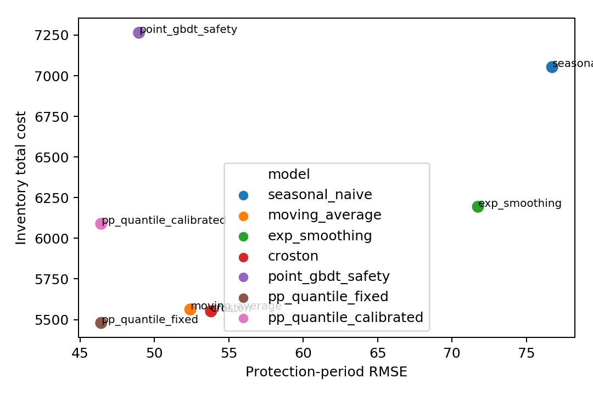
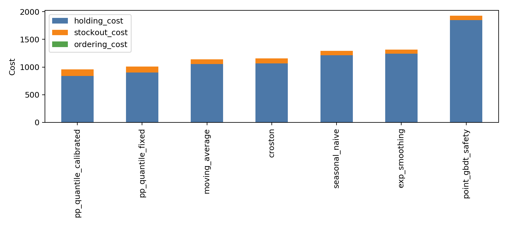
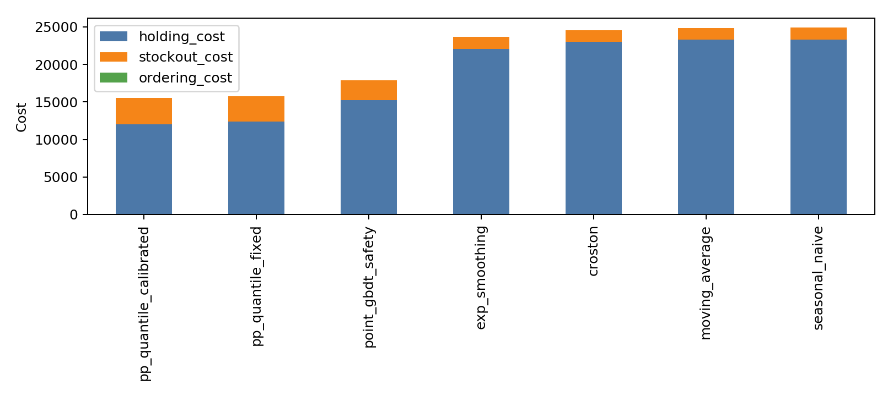

| **分 数：** |  |
|---|---|
| **评卷人：** |  |

{width=2.7in}

# 研究生“高级机器学习理论”课程报告

**题目：** 从销量预测到补货决策：面向零售库存优化的保护期分位数预测与自适应关键分位学习

**选题方向：**

□ 三个以上的基础算法解决经典的仿真问题

□ 扩展算法解决竞赛问题或实际问题

■ 提出了创新性的算法思路解决实际问题

**学号：** 请填写

**姓名：** 请填写

**专业：** 请填写

**课程指导教师：** 请填写

**院（系、所）：** 请填写

**2026年5月31日**

\newpage

# 从销量预测到补货决策：面向零售库存优化的保护期分位数预测与自适应关键分位学习

请填写姓名

（请填写院系）

**摘要：**  
零售补货中的核心目标不是单纯降低销量预测误差，而是在给定持有成本、缺货成本、订货周期和提前期的约束下做出成本更低的补货决策。本文参考 AI Cases 中“Demand Forecasting & Replenishment Optimization”的任务设定，围绕“更好的销量预测是否一定带来更好的补货决策”这一问题，构建了从经典仿真到真实零售数据的三层实验框架。第一层使用 Seasonal Naive、Moving Average、Exponential Smoothing 和 Croston 四个基础算法解决零售需求仿真问题；第二层在 AI Cases 推荐的 M5 和 Store Item Demand Forecasting Challenge 数据集上使用点预测 GBDT 与保护期分位数 GBDT 建立真实数据基线；第三层提出一种面向周期补货的保护期分位数预测与成本感知关键分位校准方法，将库存成本代理目标引入预测到决策的转换过程。实验表明，在 M5 的 1000 条底层 SKU-store 序列上，提出方法相对固定关键分位数补货降低总库存成本 5.02%；在 Store Item 全量 500 条 store-item 序列上降低 1.25%，bootstrap 95% 置信区间为 [1.15%, 1.35%]。结果说明，预测精度和库存成本之间存在明显错位，直接面向保护期需求分布和库存成本校准补货分位数，可以更稳定地改善零售补货决策。

**关键词：** 机器学习；需求预测；库存优化；分位数预测；补货决策

# 1 引言

零售企业的需求预测通常被建模为时间序列预测问题，但补货场景中的实际决策目标并不是逐日销量预测误差本身。门店和仓库需要决定在每个补货检查点订多少货，使库存能够覆盖提前期与检查周期内的需求，同时避免过量库存带来的持有成本。若只优化 MAE、RMSE 或 WRMSSE 等预测指标，模型可能在预测层面表现较好，却因为没有针对缺货成本、持有成本和服务水平进行校准，最终导致库存成本偏高。

AI Cases 的零售案例将任务定义为“Demand Forecasting & Replenishment Optimization”，并明确给出历史销量、商品属性、促销活动和外部变量等数据需求。这一任务设定说明，课程报告不应停留在“多个时间序列模型刷预测误差”的层面，而应考察预测结果如何进入补货策略。本文因此将研究问题定义为：**在零售周期补货中，更低的销量预测误差是否一定带来更低的库存成本；如果不是，是否可以通过直接预测保护期累计需求分位数并进行成本感知校准来缩小预测与决策之间的错位。**

本文采用三层递进的实验设计来满足课程报告要求。第一层使用经典基础算法在合成零售需求上进行库存仿真，验证基础方法能够解决经典仿真问题。第二层使用 AI Cases 推荐的 M5 与 Store Item Demand Forecasting Challenge 数据集进行真实数据实验，比较点预测、经验安全库存和保护期分位数预测等扩展方法。第三层提出 Adaptive Critical-Quantile Decision-Focused Replenishment（ACQ-DFR）方法，在固定分位数补货基础上学习一个受库存成本约束的自适应关键分位数，从而将预测分布更直接地转换为补货决策。

本文的主要贡献如下。第一，构建了统一的“需求预测—保护期需求分布—周期补货—库存成本评价”实验管线，使基础算法、扩展算法和提出方法在同一库存仿真器中比较。第二，将预测目标从逐日点预测调整为保护期累计需求分位数，使模型输出更贴近补货所需的 order-up-to level。第三，在冻结的分位数预测器之上学习轻量的成本感知校准层，使关键分位数随需求状态、间歇性特征和成本比变化。第四，在 M5 子集和 Store Item 全量数据上验证该方法，并通过消融、敏感性分析和代码泄漏审计说明实验结论的有效性与局限。

# 2 方法或算法

## 2.1 问题定义

考虑由多个商品-门店序列组成的零售面板数据。对每条序列 \(i\)，在补货检查点 \(t\) 已知截至 \(t\) 的历史需求、日历信息、价格或促销等特征，目标是在未来补货保护期内确定订货上限。设提前期为 \(L\)，检查周期为 \(R\)，则补货真正需要覆盖的不是单日需求，而是保护期累计需求：

\[
D^{pp}_{i,t}=\sum_{h=1}^{L+R} y_{i,t+h}.
\]

本文采用 periodic-review order-up-to 策略。令 \(I_{i,t}\) 表示现有库存，pipeline 表示在途库存，则库存位置为

\[
IP_{i,t}=I_{i,t}+\text{pipeline}_{i,t}.
\]

若模型给出订货上限 \(S_{i,t}\)，补货量为

\[
q_{i,t}=\max(0,S_{i,t}-IP_{i,t}).
\]

仿真环境采用 lost-sales 设置，即当日库存不足时未满足需求记为 lost sales，而不是延期交付。主实验成本设置为持有成本 \(c_h=1\)、缺货成本 \(c_u=5\)、固定订货成本 \(K=0\)，提前期 \(L=7\)，检查周期 \(R=7\)，因此保护期长度为 14 天。

## 2.2 第一层基础算法

第一层用于满足“三个以上基础算法解决经典仿真问题”的课程要求，并作为后续真实数据实验的解释基线。本文使用四个经典方法。

Seasonal Naive 假设需求具有周周期结构，未来第 \(h\) 天的预测值由最近一周相同相位的观测值给出。该方法没有训练参数，适合作为零售日销量预测的最低复杂度基线。

Moving Average 使用最近 28 天需求均值作为未来每日需求预测。该方法能平滑短期噪声，但无法刻画趋势变化、促销冲击和间歇性需求。

Exponential Smoothing 使用指数加权方式更新水平项：

\[
\ell_t=\alpha y_t+(1-\alpha)\ell_{t-1},
\]

并将最终水平项作为未来预测。本文实现中使用固定 \(\alpha=0.25\)，避免通过测试集调参。

Croston 方法面向间歇性需求，将正需求规模和需求间隔分开平滑，再用二者之比估计平均需求率。由于 M5 中存在大量低动销和零销量序列，Croston 是库存场景中必须包含的经典基线。

上述基础算法首先生成未来 28 天的日需求点预测，再将保护期内前 \(L+R\) 天点预测求和得到保护期需求均值。为了接入统一的库存策略，本文还用历史保护期需求标准差构造近似分位数。

## 2.3 第二层扩展算法

第二层在真实零售数据上使用机器学习扩展算法。首先建立 Point GBDT + Safety Stock 基线：LightGBM 回归模型直接预测保护期累计需求均值，随后用验证集残差标准差构造经验安全库存。该基线能体现树模型对多序列表格特征的拟合能力，但仍以均值预测为核心。

更强的第二层基线是 Protection-Period Quantile GBDT。该方法不再预测单一均值，而是直接对 \(D^{pp}_{i,t}\) 训练多个分位数模型：

\[
\hat Q_{i,t}^{(\alpha_k)},\quad
\alpha_k\in\{0.50,0.70,0.80,0.90,0.95,0.99\}.
\]

每个分位数模型使用 pinball loss，对应 LightGBM 的 quantile objective。为了避免分位数交叉，预测后对同一条样本的多个分位数进行排序。固定策略使用经典 newsvendor critical fractile：

\[
\tau^{base}=\max\left(\beta,\frac{c_u}{c_u+c_h}\right),
\]

其中 \(\beta\) 是服务水平下界。随后通过分位数插值得到订货上限：

\[
S_{i,t}=\mathrm{Interp}\left(\{(\alpha_k,\hat Q_{i,t}^{(\alpha_k)})\},\tau^{base}\right).
\]

## 2.4 第三层提出方法 ACQ-DFR

第三层提出 ACQ-DFR，即在保护期分位数预测基础上加入成本感知的自适应关键分位校准。其核心思想是：固定 critical fractile 只由成本比决定，但实际零售序列中存在间歇性、促销、近期波动和模型误差，不同 SKU-store 在相同成本比下未必应该使用完全相同的分位数。

具体地，先训练第二层的 Quantile GBDT 得到保护期分位数预测，然后冻结该预测器，只训练一个小型神经网络 \(g_\phi\) 输出对关键分位数的有界修正：

\[
\tau_{i,t}
=\mathrm{clip}\left(
\tau^{base}+\epsilon\tanh(g_\phi(z_{i,t})),
\beta,0.99
\right),
\]

其中 \(z_{i,t}\) 包含需求 lag、rolling mean/std、零销量比例、价格、促销、事件和日历特征等，\(\epsilon\) 控制校准幅度。最终订货上限为

\[
S_{i,t}=\mathrm{Interp}\left(\{(\alpha_k,\hat Q_{i,t}^{(\alpha_k)})\},\tau_{i,t}\right).
\]

校准层只在验证集上训练，训练目标是保护期 newsvendor 代理库存成本：

\[
\mathcal L_{\text{inv}}
=c_h [S_{i,t}-D^{pp}_{i,t}]_+
+c_u [D^{pp}_{i,t}-S_{i,t}]_+
+\lambda_\tau(\tau_{i,t}-\tau^{base})^2.
\]

该设计的含义是，LightGBM 负责学习需求分布，校准层负责将需求分布转换为更符合库存成本的订货分位数。本文不声称该思想是首次提出的 inventory-aware learning，而是将其作为一种轻量、可解释、适合课程项目复现的 forecast-to-decision calibration 框架。

# 3 软件结构和软件实现方法

本文代码位于 `retail_inventory_forecasting/` 目录下，主要结构如下：

```text
retail_inventory_forecasting/
  configs/
    default.yaml
  src/retail_inventory/
    data/
    features/
    models/
    inventory/
    evaluation/
    utils/
  experiments/
    run_layer1_synthetic.py
    run_m5_full.py
    run_store_item_full.py
    run_ablation.py
    run_sensitivity.py
  outputs/
    tables/
    figures/
  reports/
```

其中 `data/` 负责加载 M5、Store Item 和合成数据；`features/` 负责构造 lag、rolling、零销量比例、日历和静态类别特征；`models/` 包含 classical baseline、Point GBDT、Quantile GBDT 和成本感知校准层；`inventory/` 实现 critical fractile policy、point safety policy 和 lost-sales 周期补货仿真器；`evaluation/` 计算预测指标、分位数指标、库存 KPI 和 bootstrap 置信区间。

核心实验命令如下：

```bash
cd retail_inventory_forecasting
python experiments/run_layer1_synthetic.py --config configs/default.yaml
python experiments/run_m5_full.py --config configs/default.yaml --n-series 1000
python experiments/run_store_item_full.py --config configs/default.yaml --output-prefix store_item_full
python experiments/run_ablation.py --dataset m5 --n-series 1000
python experiments/run_sensitivity.py --dataset m5 --n-series 1000
```

本地运行环境为 Python 3.7，主要依赖包括 `numpy`、`pandas`、`scipy`、`scikit-learn`、`lightgbm==3.3.5`、`torch`、`matplotlib` 和 `seaborn`。代码、实验脚本、报告材料、结果表和图片已整理为公开 GitHub 项目；M5 原始数据以 GitHub Release 附件提供，Store Item 数据按 Kaggle 官方渠道下载：

```text
https://github.com/wangzhenyuzhangyujie/retail-inventory-forecasting
https://github.com/wangzhenyuzhangyujie/retail-inventory-forecasting/releases/tag/v1.0-course-submission
```

# 4 数据描述

## 4.1 AI Cases 任务与数据集选择

本文以 AI Cases 的 “Demand Forecasting for Inventory Optimization” 页面为任务来源。该页面将任务定义为零售需求预测与补货优化，并列出两个可用数据集：Walmart M5 Dataset 和 Store Item Demand Forecasting Challenge & Dataset。本文按该页面内容选择这两个数据集进行真实数据实验。

需要强调的是，AI Cases 本身不是实时竞赛平台，也没有 leaderboard。本文没有声称参加 Kaggle 官方比赛或取得排名，而是使用 AI Cases 推荐的竞赛/真实数据集构建本地 rolling-origin 评估。

## 4.2 合成零售仿真数据

合成数据用于第一层经典仿真实验。数据生成器构造 120 条零售序列、420 天历史，并包含四类需求状态：smooth、promo、intermittent 和 lumpy。需求由周季节、月季节、事件、促销冲击和随机噪声共同生成。该数据不用于证明方法在真实业务上的最终效果，而用于展示基础算法与库存仿真器的完整闭环。

## 4.3 M5 数据

M5 是 Walmart 日销量层级零售数据集。本文使用 M5 的 bottom-level SKU-store 序列，并采用确定性随机种子 2026 抽取 1000 条序列作为本地实验子集。每条序列使用最近 420 天历史，合并 calendar、sell price、事件和 SNAP 信息。M5 官方完整 bottom-level 包含 30490 条 SKU-store 序列，本文没有声称完成完整官方 M5 leaderboard 设置。

M5 实验的监督样本按 review epoch 构造。训练 origin 范围为 56 至 245，验证 origin 范围为 252 至 301，测试 origin 范围为 308 至 385。每个 origin 的目标为未来 14 天保护期累计需求，测试集只用于最终预测指标和库存仿真评价。

## 4.4 Store Item 数据

Store Item Demand Forecasting Challenge & Dataset 包含 10 家门店、50 个商品、5 年日销量，原始字段为 `date`、`store`、`item`、`sales`。本文使用全量训练数据，共 500 条 store-item 序列、913000 行，时间范围为 2013-01-01 至 2017-12-31。由于该数据没有价格、促销和事件字段，本文将这些可选协变量设为中性值。

Store Item 的训练 origin 范围为 56 至 1652，验证 origin 范围为 1659 至 1708，测试 origin 范围为 1715 至 1792。该设置与 M5 使用同一 rolling-origin 补货评估框架。

## 4.5 特征与评价指标

模型输入特征包括需求 lag（1、7、14、28、56 天）、rolling mean/std（7、14、28 天）、零销量比例、\(CV^2\)、价格、促销、事件、星期、月份、周末指示和静态类别变量。目标列 `target_pp`、`target_horizon` 和所有未来逐日标签 `y_h*` 在编码特征时被显式排除。

预测指标包括 MAE、RMSE、sMAPE、WAPE、pinball loss 和 quantile coverage。库存指标包括 total cost、holding cost、stockout cost、fill rate、cycle service level、stockout rate 和 average on-hand inventory。主结论以库存总成本为核心，因为补货任务的实际目标是降低库存相关成本。

# 5 实验结果

## 5.1 第一层：合成数据上的基础算法实验

表 1 给出合成零售数据上的库存仿真结果。四个基础算法均能完整进入补货仿真并给出库存成本，其中 Croston、Moving Average 和固定保护期分位数方法表现接近。成本感知校准在合成数据上没有优于固定分位数，说明自适应校准不是无条件有效的万能模块，必须通过验证集库存目标进行选择和调参。

**表 1 合成数据库存仿真结果**

| 方法 | 总成本 | 持有成本 | 缺货成本 | Fill rate | 缺货日比例 | 平均库存 |
|---|---:|---:|---:|---:|---:|---:|
| PP quantile fixed | 5479.51 | 4650.81 | 828.69 | 0.848 | 0.136 | 59.63 |
| Croston | 5550.83 | 4682.85 | 867.98 | 0.823 | 0.152 | 60.04 |
| Moving Average | 5562.22 | 4748.32 | 813.90 | 0.831 | 0.142 | 60.88 |
| PP quantile calibrated | 6089.45 | 5371.32 | 718.13 | 0.870 | 0.122 | 68.86 |
| Exponential Smoothing | 6194.28 | 5264.98 | 929.30 | 0.812 | 0.158 | 67.50 |
| Seasonal Naive | 7053.09 | 6231.08 | 822.01 | 0.842 | 0.144 | 79.89 |
| Point GBDT safety | 7264.22 | 6635.88 | 628.33 | 0.892 | 0.096 | 85.08 |



## 5.2 第二、三层：M5 子集实验

表 2 给出 M5 子集上的主实验结果。提出方法 `PP quantile calibrated` 的平均总库存成本最低，为 959.11；固定保护期分位数基线为 1009.83；四个基础算法中最好的 Moving Average 为 1137.93。相对固定分位数基线，提出方法总成本下降 5.02%，bootstrap 95% 置信区间为 [4.50%, 5.49%]。

**表 2 M5 子集库存仿真结果**

| 方法 | 总成本 | 持有成本 | 缺货成本 | Fill rate | 缺货日比例 | 平均库存 |
|---|---:|---:|---:|---:|---:|---:|
| PP quantile calibrated | 959.11 | 840.91 | 118.19 | 0.828 | 0.091 | 10.78 |
| PP quantile fixed | 1009.83 | 899.69 | 110.14 | 0.850 | 0.082 | 11.53 |
| Moving Average | 1137.93 | 1051.85 | 86.09 | 0.846 | 0.074 | 13.49 |
| Croston | 1154.64 | 1066.45 | 88.19 | 0.837 | 0.077 | 13.67 |
| Seasonal Naive | 1293.00 | 1212.15 | 80.85 | 0.879 | 0.064 | 15.54 |
| Exponential Smoothing | 1316.62 | 1238.80 | 77.82 | 0.882 | 0.062 | 15.88 |
| Point GBDT safety | 1925.55 | 1845.60 | 79.96 | 0.961 | 0.030 | 23.66 |



该结果体现了预测和决策之间的错位。Point GBDT safety 的 fill rate 最高，达到 0.961，但平均库存也最高，导致总成本最差。提出方法的 fill rate 低于固定分位数，但显著降低持有成本，使总成本更低。这说明在给定 \(c_h=1,c_u=5\) 的成本结构下，盲目提高服务水平并不是最优补货决策。

## 5.3 Store Item 全量实验

表 3 给出 Store Item 全量数据上的结果。提出方法仍然取得最低总成本 15529.37，固定保护期分位数基线为 15726.16，相对下降 1.25%，bootstrap 95% 置信区间为 [1.15%, 1.35%]。四个基础算法的平均总成本为 24504.82，提出方法相对其下降 36.63%。

**表 3 Store Item 全量库存仿真结果**

| 方法 | 总成本 | 持有成本 | 缺货成本 | Fill rate | 缺货日比例 | 平均库存 |
|---|---:|---:|---:|---:|---:|---:|
| PP quantile calibrated | 15529.37 | 12004.22 | 3525.15 | 0.838 | 0.228 | 153.90 |
| PP quantile fixed | 15726.16 | 12355.86 | 3370.30 | 0.847 | 0.217 | 158.41 |
| Point GBDT safety | 17882.58 | 15234.74 | 2647.83 | 0.887 | 0.157 | 195.32 |
| Exponential Smoothing | 23681.29 | 22027.94 | 1653.35 | 0.923 | 0.103 | 282.41 |
| Croston | 24571.17 | 22971.57 | 1599.60 | 0.925 | 0.099 | 294.51 |
| Moving Average | 24874.23 | 23316.66 | 1557.57 | 0.927 | 0.096 | 298.93 |
| Seasonal Naive | 24892.58 | 23325.80 | 1566.77 | 0.927 | 0.097 | 299.05 |



M5 与 Store Item 的定性排序一致，均为第三层优于第二层、第二层优于第一层。但二者的效果强度不同：M5 上第 3 层相对第 2 层提升 5.02%，Store Item 上为 1.25%。原因在于 Store Item 更规则、更密集，且缺少促销、价格和事件等异质协变量，固定 critical fractile 已经能够捕捉较多决策信息，自适应校准的额外空间较小。

**表 4 两个 AI Cases 数据集上的层级提升**

| 数据集 | 第 2 层相对第 1 层平均提升 | 第 3 层相对第 2 层提升 | 第 3 层相对第 1 层平均提升 |
|---|---:|---:|---:|
| M5 子集 | 17.60% | 5.02% | 21.74% |
| Store Item 全量 | 35.82% | 1.25% | 36.63% |

## 5.4 消融实验

表 5 给出 M5 子集上的消融结果。去掉 \(\tau\) 自适应后，`PP quantile calibrated` 与 `PP quantile fixed` 完全一致，说明第 3 层收益来自自适应 critical-fractile 校准，而不是结果表命名或后处理差异。使用更强的 \(\tau\) 正则化后，方法仍保持约 959 的总成本。仅使用短 lag 和短 rolling 特征时，整体成本上升，但校准方法仍优于对应固定分位数基线。

**表 5 M5 消融实验结果**

| 消融设置 | 方法 | 总成本 | 持有成本 | 缺货成本 | Fill rate | 缺货日比例 | 平均库存 |
|---|---|---:|---:|---:|---:|---:|---:|
| Full | PP quantile calibrated | 959.11 | 840.91 | 118.19 | 0.828 | 0.091 | 10.78 |
| Full | PP quantile fixed | 1009.83 | 899.69 | 110.14 | 0.850 | 0.082 | 11.53 |
| No tau adaptation | PP quantile calibrated | 1009.83 | 899.69 | 110.14 | 0.850 | 0.082 | 11.53 |
| Strong tau regularization | PP quantile calibrated | 959.00 | 840.07 | 118.93 | 0.828 | 0.092 | 10.77 |
| Short lags only | PP quantile calibrated | 1024.86 | 911.04 | 113.82 | 0.847 | 0.084 | 11.68 |
| Short lags only | PP quantile fixed | 1090.56 | 987.57 | 102.99 | 0.868 | 0.074 | 12.66 |

## 5.5 敏感性分析

敏感性实验改变提前期 \(L\in\{3,7,14\}\) 和缺货成本 \(c_u\in\{3,5,9\}\)。结果显示，当缺货成本较高或提前期较长时，自适应校准收益更明显。例如 \(L=14,c_u=9\) 时，校准方法总成本为 1368.47，固定分位数为 1626.45。相反，在 \(L=3,c_u=5\) 的短提前期中，固定分位数优于校准方法，说明自适应校准应当通过验证集选择，而不应被写成无条件优于所有场景。

**表 6 M5 敏感性分析：固定分位数与校准分位数**

| Lead time | 缺货成本 | 方法 | 总成本 | Fill rate | 缺货日比例 | 平均库存 |
|---:|---:|---|---:|---:|---:|---:|
| 3 | 3 | Calibrated | 701.00 | 0.771 | 0.120 | 7.84 |
| 3 | 3 | Fixed | 701.00 | 0.771 | 0.120 | 7.84 |
| 3 | 5 | Fixed | 793.20 | 0.791 | 0.111 | 8.34 |
| 3 | 5 | Calibrated | 847.85 | 0.799 | 0.109 | 9.04 |
| 3 | 9 | Calibrated | 881.27 | 0.771 | 0.120 | 7.84 |
| 3 | 9 | Fixed | 974.46 | 0.825 | 0.096 | 9.51 |
| 7 | 5 | Calibrated | 959.11 | 0.828 | 0.091 | 10.78 |
| 7 | 5 | Fixed | 1009.83 | 0.850 | 0.082 | 11.53 |
| 14 | 9 | Calibrated | 1368.47 | 0.896 | 0.059 | 15.71 |
| 14 | 9 | Fixed | 1626.45 | 0.939 | 0.037 | 19.56 |

## 5.6 实验有效性检查

为避免“实验开后门”或测试集泄漏，本文对代码进行了专门检查。主监督模型只在训练集上拟合，校准层只在验证集上拟合，测试标签仅用于最终评价。特征编码时 `target_pp`、`target_horizon` 和所有未来逐日标签 `y_h*` 均被删除。M5 的训练、验证、测试 origin 范围分别为 56--245、252--301、308--385；Store Item 的对应范围为 56--1652、1659--1708、1715--1792，三者没有重叠。

本文同时承认三个局限。第一，实验是本地 rolling-origin 补货仿真，不是 Kaggle hidden-test leaderboard 提交；后续测试 review 点允许使用此前已经观测到的历史销量。第二，当前实现中 `lag_1` 使用 origin 当天销量，而库存仿真在同一天先下单再消耗需求，存在日初/日末决策约定不完全一致的问题；本文将其视为时序约定局限，后续可通过后移 lag 或调整仿真顺序做严格版本。第三，M5 的缺失价格填充使用了所选面板的中位数，虽然不是需求标签泄漏，但更严格的实现应只用训练期统计量。

# 6 总结

本文围绕零售需求预测与库存补货优化构建了一个完整课程报告项目。第一层实验使用四个基础算法完成经典仿真补货问题；第二层实验在 AI Cases 推荐的 M5 和 Store Item 数据集上使用 LightGBM 和保护期分位数预测解决真实零售问题；第三层提出 ACQ-DFR 方法，通过成本感知的自适应 critical-fractile 校准将保护期需求分布转换为更优补货决策。

实验结果表明，预测误差与库存成本之间并不完全一致。在 M5 子集上，提出方法相对固定分位数补货降低 5.02% 总库存成本；在 Store Item 全量数据上降低 1.25%。消融实验表明，去掉 \(\tau\) 自适应后方法退化为固定分位数基线，说明收益确实来自成本感知校准层。敏感性实验进一步显示，该方法在缺货成本较高或保护期较长时更有效，但在部分短提前期场景下可能不如固定策略。

因此，本文的核心结论是：在零售补货场景中，最优预测不等于最优决策。相比只优化销量预测误差，直接预测保护期累计需求分位数，并用库存成本校准关键订货分位数，可以更系统地缩小 forecasting 与 replenishment decision 之间的目标错位。

# 参考文献

[1] AI Cases. Demand Forecasting for Inventory Optimization. https://ai-cases.com/retail/demand-forecasting-for-inventory-optimization/

[2] Makridakis S., Spiliotis E., Assimakopoulos V. The M5 accuracy competition: Results, findings and conclusions. International Journal of Forecasting, 2022.

[3] Makridakis S., Spiliotis E., Assimakopoulos V., et al. The M5 uncertainty competition: Results, findings and conclusions. International Journal of Forecasting, 2022.

[4] Kaggle. Store Item Demand Forecasting Challenge. https://www.kaggle.com/competitions/demand-forecasting-kernels-only

[5] Ke G., Meng Q., Finley T., et al. LightGBM: A Highly Efficient Gradient Boosting Decision Tree. Advances in Neural Information Processing Systems, 2017.

[6] Croston J. D. Forecasting and Stock Control for Intermittent Demands. Operational Research Quarterly, 1972.

[7] Ban G. Y., Rudin C. The Big Data Newsvendor: Practical Insights from Machine Learning. Operations Research, 2019.

[8] Cao Y., Shen Z. J. M. Quantile Forecasting and Data-Driven Inventory Management under Nonstationary Demand. Operations Research Letters, 2019.

[9] Elmachtoub A. N., Grigas P. Smart “Predict, then Optimize”. Management Science, 2022.

[10] Qi M., Shi Y., Qi Y., et al. A Practical End-to-End Inventory Management Model with Deep Learning. Management Science, 2023.

| **研究生签字** |  |
|---|---|
